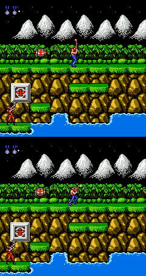

# 8. Behavior Data Collection
{: .no_toc }

**Date:** 2026-03-18 · **Type:** Dataset
{: .fs-5 .fw-300 }

---

  
Table of Contents

  {: .text-delta }
1. TOC
{:toc}

---

## Why We Need Our Own Dataset

The behavior cloning paper described in Chapter 7 was released alongside a dataset of approximately 8,000 recordings from professional human players. However, the vast majority of those recordings come from modern 3D first-person shooters. Contra NES is a fundamentally different type of game — a 2D side-scrolling and top-down action game from 1987, with a completely different visual language, control scheme, and game-play structure. Pre-existing datasets offer no useful coverage of this game, so we must build our own.

## Dataset Structure

Each recording in the dataset consists of three aligned components.

**Video.** The raw game frames captured during a human play session, at the emulator's native resolution and frame rate. This is the perceptual input the model will see at inference time.

**Actions.** The controller input recorded at every frame — a binary vector over the NES button set. Each frame's action is captured in exact correspondence with the video, so the model can learn the precise timing of jumps, shots, and direction changes.

**Text annotations.** A sequence of timestamped natural-language descriptions that narrate what the player should be doing at each moment in the run. These are the text tokens described in Chapter 7 — the channel that carries game wisdom into the model.

## Generating Text Annotations with Gemini

Writing frame-by-frame annotations by hand would be impractical at scale. Instead, we use **Gemini 3.0 Flash Preview**, a commercial vision-language model, to automatically generate the text annotations from the game video. The results are high quality and the API cost is affordable, making this approach viable for building a dataset large enough to train a baseline.

A sample annotation from a Level 1 run illustrates the output:

| Start | End | Text |
|-------|-----|------|
| 00:03 | 00:07 | Destroy the stationary red-pulsing gun turret on the platform. |
| 00:08 | 00:11 | Retrieve the flashing red power-up capsule from the air. |
| 00:13 | 00:15 | Clear the gap by jumping across the destroyed bridge section. |
| 00:24 | 00:27 | Neutralize the enemy sentry post mounted on the cliff wall. |
| 00:34 | 00:37 | Eliminate the wall-mounted turret to secure the ledge. |
| 00:44 | 00:49 | Take out the two mechanical base defense units on the lower platforms. |
| 00:51 | 00:54 | Deal with the soldier standing on the elevated cliff ledge. |
| 01:13 | 01:14 | Destroy the stationary defensive cannon on the rocky outcrop. |
| 01:25 | 01:27 | Clear the small guard turret near the base of the large structure. |
| 01:32 | 01:52 | Focus fire on the large mechanical base gate to destroy it. |

The annotations are task-oriented and spatially grounded — each entry describes a concrete objective at a specific moment, rather than a vague running commentary. This is exactly the kind of high-level instruction the transformer executor needs in its text token stream: short, actionable, tied to what is visible on screen.

The timestamped format also means we can align text segments to video frames precisely, constructing a training example where each frame is paired with the annotation that was active at that moment.

## A Serious Problem: Action Downsampling

The p2p project ships a built-in data collection application called **recap**, which records game video and keyboard/mouse inputs automatically during play. It was the natural first choice for capturing the action component of the dataset.

The problem is one of temporal resolution. A human can press and release keys at any speed — tapping a button for a single frame is a meaningful action in a game like Contra. Recap logs video and inputs at **20 Hz**, meaning each time window is 50 ms wide. Within each 50 ms window, multiple key events may occur. Recap resolves this by **max-pooling** the inputs: if a button was pressed at any point in the window, it is recorded as held for the entire window.

This is a lossy compression. Brief taps become extended holds. Rapid alternating inputs collapse into a single sustained press. The logged action sequence is not what the human did — it is a downsampled approximation.

For many games this is acceptable. For Contra, it is not. The game requires precise frame-level control: a tap-jump lands differently from a held jump; a brief fire press versus a sustained one changes the shooting rhythm. Errors in the action log accumulate over time, and the trajectory of the run diverges further and further from the human's original path.

We verified this with a direct test: every winning run in our dataset, when replayed using the downsampled action sequence rather than the original, **fails to win**. The divergence begins early. The image below shows the first frame where the replayed trajectory separates from the original in one representative run.

## Solution: Make the Game Run at 20 Hz

The 20 Hz constraint is not an arbitrary choice by recap — it is a hard limit imposed by the agent's computational budget. A transformer model that consumes image and text tokens and produces action tokens cannot run faster than this: the time to process input and generate the output token caps the decision rate at around 20 Hz on available hardware. The agent will always operate at 20 Hz.

The correct fix is therefore not to improve the recording fidelity of recap. It is to **make the human play at the same rate the agent will**, so that the recorded demonstrations match the condition under which the trained policy will actually be deployed.

The plan is to build a custom Contra recording application where the **game engine itself is throttled to 20 Hz** — one emulator step every 50 ms. At this rate, each frame corresponds to exactly one input window. There is no gap between the game's update rate and the recording rate. Whatever button the human presses between two frames is the action for that frame, with no pooling, no ambiguity, and no loss.